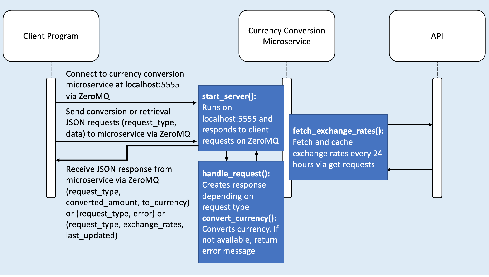

# Microservice A - Currency Converter

## Table of Contents
+ [Overview](#overview)
+ [Requirements](#requirements)
+ [Setting Up Python Virtual Environment](#venv)
+ [Install Requirements](#reqs)
+ [Start the Server](#start)
+ [Connect to the Server](#connect)
+ [Test Program](#test)
+ [UML Diagram](#uml)
+ [Contributors](#contributors)

# Overview<a name="overview"></a>
This is a microservice that leverages the API at "https://api.exchangerate-api.com/v4/latest/USD" to provide the following services:
1) Given a user provides an amount, a target currency, and a source currency (if not included then assumed to be USD) when the request is sent to the currency conversion service, then the system should return the converted amount based on the latest exchange rate.
2) Given it has been 24 hours since the last update, when the scheduled task runs, then the system should fetch the latest exchange rates from the external API and store them in the cache.
3) Given a user requests the latest top 10 exchange rates, when the request is sent to tthe currency conversion service, then the system should return the cached exchange rates and the last updated timestamp.

# Requirements<a name="requirements"></a>
- Python 3.9+
- VSCode Recommended

# Setting Up Python Virtual Environment<a name="venv"></a>
It is recommended that you use a Python virtual environment for this (and all) Python projects.

## Creating a Python Virtual Environment

### Windows, macOS, and Linux

1. Launch Command Prompt, PowerShell, or your terminal emulator

2. Enter the following command to ensure you have the correct version of Python installed:

    ```bash
    python --version
    ```

    > Depending on your Python configuration, you may need to enter the following command instead:

    ```bash
    python3 --version
    ```

    > Keep track of which command works, and use it for each after this. For brevity, only `python` will be shown in examples.

3. Enter the following command to create a virtual environment named `env`:

    ```bash
    python -m venv env
    ```

    > Optionally, you may specify the Python version for the virtual environment:

    ```bash
    py -3.9 -m venv env
    ```

## Activate the Virtual Environment

### VSCode

1. Open the Command Palette and select `Python: Select Interpreter`
2. Select the interpreter located in the virtual environment `('env':venv)`
3. Reload your terminal

### Windows

- In the PowerShell or Command Prompt, enter the following command to activate the virtual environment:
    
    ```
    cd env\Scripts\
    .\activate
    cd ..\..
    ```

### macOS and Linux

- In the terminal, enter the following command to activate the virtual environment:
    
    ```sh
    source env/bin/activate
    ```

# Install Requirements<a name="reqs"></a>

- Within the virtual environment, enter the following command into the terminal to install all requirements. For all future commands it is assumed that they will be executed from within the virtual environment.
   
    ```bash
    python -m pip install -U -r requirements.txt
    ```

# Start the Server<a name="start"></a>
Run the following command to start the server on port 5555:
- `python3 currency.py`

# Connect to the Server<a name="connect"></a>
To request data from the server, client programs can connect to the server via socket.connect per the example call below:

    context = zmq.Context()
    socket = context.socket(zmq.REQ)
    socket.connect("tcp://localhost:5555")

## Request Data from the Server
There are 2 types of requests: 
1. In the case of the first user story, the request parameters are the request_type (“conversion”) and data (an amount, target currency and source currency(presumed to be USD if not included)). Example request:
    
    conversion_request = {
        "request_type": "conversion",
        "data": {
            "amount": 100,
            "from_currency": "USD",
            "to_currency": "EUR"
        }
    }

2. In the case of the third user story, the request parameter is the request_type (“retrieval”). Example request:
    
    retrieval_request = {
        "request_type": "retrieval",
        "data": {}
    }

The request parameters in JSON can be sent to the microservice via socket.send_string() per the example call below:

    socket.send_string(json.dumps(request_data))

## Receive Data from the Server
The input received from the server will be parsed out to use both the request_type and the data.
1. In the case of the first user story, a JSON of the request_type and data (a converted amount, and target currency) will be sent back. If currency not supported, data will include error. Example response:
    
    Conversion Response: {'request_type': 'conversion', 'converted_amount': 95.7, 'to_currency': 'EUR'}
    Conversion Response: {'request_type': 'conversion', 'error': 'Currency not supported.'}

2. In the case of third user story, a JSON of the request_type and data (the exchange rates for the top 10 currencies, and a time stamp) will be sent back. Example response:

    Retrieval Response: {'request_type': 'retrieval', 'exchange_rates': {'EUR': 0.957, 'JPY': 151.88, 'CAD': 1.42, 'GBP': 0.793, 'AUD': 1.57, 'MXN': 20.26, 'CHF': 0.903, 'HKD': 7.78, 'SGD': 1.34, 'CNY': 7.28}, 'last_updated': '2025-02-19 15:09:23'}

The response parameters in JSON can be received from the microservice via socket.recv_string() per the example call below:

    response = socket.recv_string()
    return json.loads(response)

# Test Program<a name="test"></a>
Run the following command in a separate terminal to run the test program:
- `python3 test.py`

# UML Diagram<a name="uml"></a>


# Contributors<a name="contributors"></a>
- Wei-Yin Chen 


